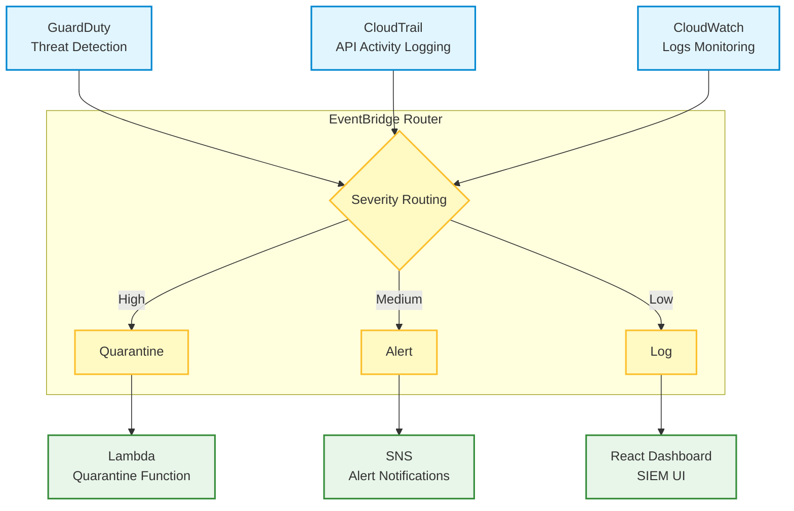
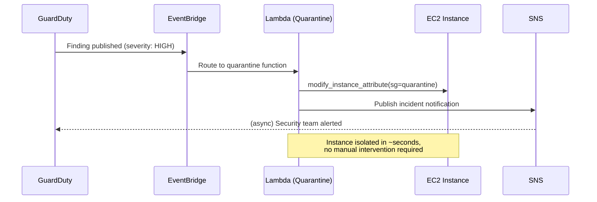

# 🛡️ GuardDuty SIEM & Incident Response Automation

Enterprise-grade Security Information and Event Management (SIEM) with automated incident response, threat detection, and real-time security monitoring

## 🎯 Project Overview

This project implements a comprehensive Security Information and Event Management (SIEM) solution using AWS GuardDuty, CloudTrail, and EventBridge. It features automated incident response with Lambda functions that can quarantine compromised EC2 instances and send real-time alerts through SNS. The solution includes an optional React dashboard for security monitoring and log analysis.

## 🏆 Key Achievements

- ✅ Automated Threat Detection - GuardDuty with malware protection
- ✅ Real-time Incident Response - Auto-quarantine compromised instances
- ✅ Comprehensive Logging - CloudTrail and CloudWatch integration
- ✅ Event-Driven Architecture - EventBridge for security event routing
- ✅ Security Dashboard - React-based SIEM monitoring interface

## 🏗️ Architecture Diagram



## 🔀 Incident Response Sequence



## 🚀 Features & Technologies

### 🛡️ Security Features
- Threat Detection - GuardDuty with malware protection and threat intelligence
- Automated Response - Lambda functions for immediate incident response
- Real-time Alerts - SNS notifications for security events
- Log Aggregation - Centralized logging with CloudWatch
- API Monitoring - CloudTrail for complete API activity tracking

### 🛠️ AWS Services Integration
- GuardDuty - Threat detection and security monitoring
- CloudTrail - API activity logging and audit trails
- EventBridge - Event routing and processing
- Lambda - Serverless incident response automation
- SNS - Real-time alert notifications
- CloudWatch - Log aggregation and monitoring

### 📊 Monitoring & Analytics
- Security Dashboard - React-based SIEM interface
- Threat Intelligence - GuardDuty findings and analysis
- Incident Timeline - Automated response tracking
- Log Analysis - CloudWatch log insights and queries

## 🏃‍♂️ Quick Start

### Prerequisites
- Terraform >= 1.7
- AWS CLI configured
- Node.js >= 16 (for React dashboard)
- AWS Account with GuardDuty and Config permissions

### 🚀 Deployment

**Clone and Navigate**
```bash
git clone <your-repo>
cd guardduty-siem
```

**Deploy Infrastructure**
```bash
# Initialize Terraform
terraform init

# Plan deployment
terraform plan

# Apply changes
terraform apply -auto-approve
```

**Deploy React Dashboard (Optional)**
```bash
cd react-dashboard
npm install
npm start
```

**Verify Deployment**
```bash
# Check GuardDuty status
aws guardduty list-detectors

# Check EventBridge rules
aws events list-rules

# Check Lambda functions
aws lambda list-functions
```

### 🧹 Cleanup
```bash
terraform destroy -auto-approve
```

## 💰 Cost Analysis

| Resource | Monthly Cost | Purpose |
|---|---|---|
| GuardDuty | ~$30 | Threat detection (first 30 days free) |
| CloudTrail | ~$2 | API activity logging |
| EventBridge | ~$1 | Event routing |
| Lambda | ~$0.20 | Incident response automation |
| SNS | ~$0.50 | Alert notifications |
| CloudWatch | ~$3 | Log storage and monitoring |
| **Total** | **~$37** | Complete SIEM solution |

💡 **Cost Optimization**: GuardDuty offers 30-day free trial; most costs are for log storage

## 🔧 Configuration

### Variables (terraform.tfvars)
```hcl
# Project Configuration
project_name = "guardduty-siem"
environment = "dev"

# GuardDuty Configuration
enable_malware_protection = true
enable_s3_protection = true
enable_kubernetes_protection = true

# Notification Configuration
alert_email = "security@company.com"
slack_webhook_url = "https://hooks.slack.com/..."

# Auto-remediation Configuration
enable_auto_quarantine = true
quarantine_security_group_id = "sg-xxxxxxxxx"
```

### EventBridge Rules
- **High Severity** - Auto-quarantine compromised instances
- **Medium Severity** - Send immediate alerts
- **Low Severity** - Log for analysis

## 📁 Project Structure

```
guardduty-siem/
├── versions.tf                 # Terraform and provider versions
├── providers.tf                # AWS provider configuration
├── variables.tf                # Input variables
├── guardduty.tf                # GuardDuty detector configuration
├── cloudtrail.tf               # CloudTrail logging setup
├── eventbridge-pipeline.tf     # Event routing and processing
├── lambda-quarantine.tf        # Auto-quarantine Lambda function
├── lambda-logger.tf            # Logging Lambda function
├── outputs.tf                  # Terraform outputs
├── react-dashboard/            # SIEM monitoring dashboard
│   ├── package.json            # Node.js dependencies
│   ├── src/App.js              # React application
│   └── src/App.css             # Dashboard styling
└── README.md                   # This file
```

## 🎓 Learning Outcomes

This project demonstrates mastery of:

### 🛡️ Security Operations
- SIEM Implementation - Security Information and Event Management
- Threat Detection - GuardDuty threat intelligence and analysis
- Incident Response - Automated security incident handling
- Security Monitoring - Real-time threat detection and alerting

### 🔄 Automation & Orchestration
- Event-Driven Architecture - EventBridge for security event processing
- Serverless Automation - Lambda functions for incident response
- Workflow Automation - Automated threat response workflows
- Integration Patterns - AWS service integration and orchestration

### 📊 Monitoring & Analytics
- Log Aggregation - Centralized security logging
- Threat Intelligence - GuardDuty findings and analysis
- Dashboard Development - React-based security monitoring
- Alert Management - SNS notification systems

### 🏢 Enterprise Security
- Compliance Monitoring - Security compliance and audit trails
- Risk Management - Threat assessment and mitigation
- Security Operations Center (SOC) - Security monitoring practices
- Incident Management - Security incident response procedures

## 🚀 Future Enhancements
- Machine Learning - Custom threat detection models
- Threat Hunting - Advanced threat hunting capabilities
- Integration - Third-party SIEM integration (Splunk, QRadar)
- Mobile App - Security alerts mobile application
- Advanced Analytics - Security metrics and reporting
- Compliance Reporting - Automated compliance reports

## 🔧 Lambda Functions

### Auto-Quarantine Function
```python
import json
import boto3

def lambda_handler(event, context):
    """
    Automatically quarantines EC2 instances based on GuardDuty findings
    """
    ec2 = boto3.client('ec2')

    # Extract instance ID from GuardDuty finding
    instance_id = event['detail']['service']['resourceRoleDetails']['accessKeyDetails']['principalId']

    # Apply quarantine security group
    response = ec2.modify_instance_attribute(
        InstanceId=instance_id,
        Groups=['sg-quarantine']
    )

    return {
        'statusCode': 200,
        'body': json.dumps(f'Instance {instance_id} quarantined successfully')
    }
```

### Logging Function
```python
import json
import boto3

def lambda_handler(event, context):
    """
    Logs security events to CloudWatch for analysis
    """
    cloudwatch = boto3.client('cloudwatch')

    # Log security event
    cloudwatch.put_metric_data(
        Namespace='Security/SIEM',
        MetricData=[
            {
                'MetricName': 'SecurityEvent',
                'Value': 1,
                'Unit': 'Count',
                'Dimensions': [
                    {
                        'Name': 'Severity',
                        'Value': event['detail']['severity']
                    }
                ]
            }
        ]
    )

    return {'statusCode': 200}
```

## 🤝 Contributing
1. Fork the repository
2. Create a feature branch (`git checkout -b feature/amazing-feature`)
3. Commit your changes (`git commit -m 'Add amazing feature'`)
4. Push to the branch (`git push origin feature/amazing-feature`)
5. Open a Pull Request

## 📄 License
This project is licensed under the MIT License - see the LICENSE file for details.

## 👨‍💻 Author
**Mihir Ajmera** — GRC Engineer & Cloud Security

- LinkedIn: [Mihir Ajmera](https://linkedin.com/in/mihirajmera)
- GitHub: [Mihirajmera](https://github.com/Mihirajmera)
- Email: ajmera.mihir.79@gmail.com

⭐ Star this repository if you found it helpful!

*This project showcases enterprise-level SIEM implementation and automated incident response — demonstrating security operations expertise for technical interviews.*
